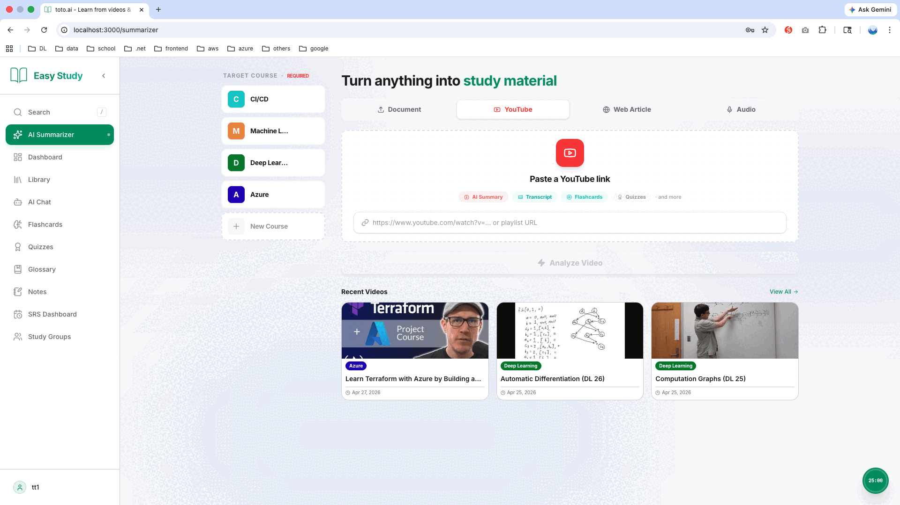

<div align="center">

# Study Platform

### AI-powered learning — from any content, in any subject

[](https://dotnet.microsoft.com)
[](https://react.dev)
[](https://www.typescriptlang.org)
[](https://www.postgresql.org)
[](https://redis.io)
[](LICENSE)

</div>

Upload documents, videos (YouTube · Bilibili · your own files), podcasts, and web articles — AI generates summaries, flashcards, quizzes, glossaries, and mind maps. Master any topic with spaced repetition, an exam planner with AI mock exams, and an AI tutor.

---



---

## Features

|     | Category             | What you get                                                                                                 |
| --- | -------------------- | ------------------------------------------------------------------------------------------------------------ |
| 📄  | **Content Sources**  | PDF / DOCX, YouTube & Bilibili, uploaded videos, web article clipping, audio files, Apple Podcasts           |
| 🤖  | **AI Generation**    | Summaries, flashcards (basic / cloze / chart), quizzes, glossaries, mind maps, worked problems               |
| 🎯  | **Study Tools**      | Rich-text notes, AI tutor (voice + graded teach-back), FSRS-4.5 spaced repetition, question bank, knowledge graph & learning paths |
| 🗓️  | **Today & Practice** | Daily study plan with goal budgeting, unified Practice / Exam mode (quiz · flashcard · glossary · problem), timed runner |
| 🎓  | **Exam Prep**        | Exam planner with countdown & day-by-day schedule, timed AI mock exams, mistakes notebook, reinforcement center |
| 📊  | **Insights**         | Time-on-task & accuracy analytics, per-course mastery, knowledge-gap detection, AI recommendations, XP & levels |
| 🔔  | **Reminders**        | Notification digest — due cards, streak-at-risk, daily-goal progress, top knowledge gaps                     |
| 📴  | **Offline PWA**      | Installable app shell; flashcards & glossary cached for offline review with background sync                  |
| 🔊  | **Extras**           | PDF annotations, text-to-speech, full-text search + ask-your-library AI answers (cited sources), public share links |
| 🔄  | **Import / Export**  | Anki import & export, Notion / Markdown ZIP import, study-pack export (PDF / CSV), ICS calendar feed, web clipper |
| 👥  | **Study Groups**     | Shared courses & documents, real-time chat, assignments, live quiz battles, XP leaderboard                   |
| 🔐  | **Auth**             | Email + OTP, Google / GitHub OAuth, JWT sessions                                                             |

**AI Providers** — Gemini · OpenAI · Claude · Grok · DeepSeek · Kimi · Doubao · Qwen · Wenxin Yiyan (multi-provider routing, switchable from settings)

---

## Tech Stack

**Backend** — .NET 10 · ASP.NET Core · EF Core 9 · MediatR · FluentValidation · SignalR · PostgreSQL · Redis · Amazon S3 · yt-dlp · ffmpeg · Whisper.net · MailKit · JWT

**Frontend** — React 19 · TypeScript 5.8 · Vite 6 · TailwindCSS 4 · React Router 7 · Tiptap · D3.js + Markmap · Service Worker + idb-keyval (offline PWA)

**Architecture** — Clean Architecture · CQRS · Repository + Unit of Work · SSE streaming

---

## Local Setup

**Prerequisites** — .NET SDK 10 · Node.js 18+ · PostgreSQL 14+ · Redis 7+ · ffmpeg · AWS CLI
**Required services** — Google Gemini API key, Google & GitHub OAuth apps, SMTP/SES email, S3 or MinIO storage (other AI providers optional)

```bash
# 1. Clone
git clone https://github.com/your-username/Study_Platform.git
cd Study_Platform

# 2. Create database
psql postgres -c "CREATE USER studyplatform WITH PASSWORD 'yourpassword';"
psql postgres -c "CREATE DATABASE studyplatform OWNER studyplatform;"

# 3. Start local services (MinIO console: http://localhost:9001, minioadmin / minioadmin123)
redis-server
docker compose up -d minio minio-init

# 4. Configure server/StudyPlatform.API/appsettings.Development.json (see below)

# 5. Migrate & run backend
cd server
dotnet ef database update --project StudyPlatform.Infrastructure --startup-project StudyPlatform.API
dotnet run --project StudyPlatform.API     # → http://localhost:5001

# 6. Run frontend
cd web && npm install && npm run dev       # → http://localhost:3000
```

---

## Configuration

**`server/StudyPlatform.API/appsettings.Development.json`**

```jsonc
{
	"ConnectionStrings": { "DefaultConnection": "Host=localhost;Port=5432;Database=studyplatform;Username=studyplatform;Password=yourpassword" },
	"Redis": { "Enabled": false, "ConnectionString": "localhost:6379" },
	"JwtSettings": { "SecretKey": "your-32-char-secret", "AccessTokenExpiryMinutes": 15, "RefreshTokenExpiryDays": 7 },
	"EmailSettings": { "Provider": "Ses", "FromEmail": "you@gmail.com", "SesRegion": "ap-southeast-2" }, // or SMTP fallback
	"S3": {
		"BucketName": "documents-dev",
		"ServiceUrl": "http://localhost:9000",        // local MinIO
		"PublicServiceUrl": "http://localhost:9000",
		"ForcePathStyle": true,
		"AccessKey": "minioadmin",
		"SecretKey": "minioadmin123",
	},
	"GoogleOAuth": { "ClientId": "xxxx.apps.googleusercontent.com", "ClientSecret": "GOCSPX-..." },
	"GitHubOAuth": { "ClientId": "Ov23lic...", "ClientSecret": "..." },
	"Cors": { "AllowedOrigins": ["http://localhost:3000", "http://localhost:3001"] },
	"AppLimits": { "DocumentUploadLimit": -1 }, // -1 = unlimited; hosted default is 10 documents / audio / video uploads per account
}
```

**`web/.env.local`** (and **`admin/.env.local`** with just `VITE_API_URL`)

```bash
VITE_API_URL=http://localhost:5001
VITE_GOOGLE_CLIENT_ID=xxxx.apps.googleusercontent.com
VITE_GITHUB_CLIENT_ID=Ov23lic...
```

---

## Web Clipper

Clip any web page into your library as a cleaned-up Markdown article:

- **Browser extension** — load `extension/` as an unpacked extension (Chrome / Edge / Brave). See [extension/README.md](extension/README.md).
- **Bookmarklet** — Settings → Export → **Web Clipper bookmarklet**; no install needed.

---

## Deployment

### Docker (self-hosted)

Bundles PostgreSQL, Redis, and MinIO — no external database, cache, or storage account needed.

```bash
cp .env.example .env          # fill in all values
docker compose up --build -d
docker compose exec api dotnet ef database update \
  --project StudyPlatform.Infrastructure --startup-project StudyPlatform.API
```

Web `:3000` · Admin `:4200` · API + Swagger `:5001` · MinIO console `:9001`

> `VITE_*` variables are baked in at build time — rebuild frontend images after changing them. MinIO credentials and bucket come from `.env` (`MINIO_ROOT_USER` / `MINIO_ROOT_PASSWORD` / `S3_BUCKET_NAME`); `S3_PUBLIC_SERVICE_URL` must be reachable from the host browser.

### AWS

`./deploy.sh` provisions ECS on a low-cost EC2 instance (`t3.micro`, `ECS_MEMORY=768` by default — override for more headroom), an ALB for the API, RDS PostgreSQL, ElastiCache Redis, S3 buckets, and static `web` / `admin` frontends. Export `DB_PASS`, `JWT_SECRET`, `GOOGLE_CLIENT_ID/SECRET`, `GITHUB_CLIENT_ID/SECRET`, `SMTP_USER`, and `SMTP_PASSWORD` before running it.

### Video transcripts (production)

YouTube / Bilibili use captions when available, then fall back to yt-dlp + Whisper; uploaded videos are transcribed with ffmpeg + Whisper. YouTube may block cloud IPs — set `YOUTUBE_PROXY_URL` (SOCKS/HTTP proxy) and optionally `YOUTUBE_COOKIES_B64="$(base64 < cookies.txt | tr -d '\n')"` before running `./deploy-backend.sh`.

---

## License

[MIT](LICENSE)
